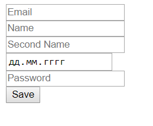

# SpringRestService
Simple REST-service to store and manage user accounts.
Passwords are stored in a secure form, in-memory database used. 

1) Add a user:

    (POST) http://localhost:8080/newUser

    the request body must contain: email, name, secondName, password and birthday.
    
    or just run index.html in root directory
    
    
    
2) Find user:

    (GET) http://localhost:8080/find
    
    the request body must contain user's email.
    
3) Delete user:

    (DELETE) http://localhost:8080/remove
    
    the request body must contain user's email.
